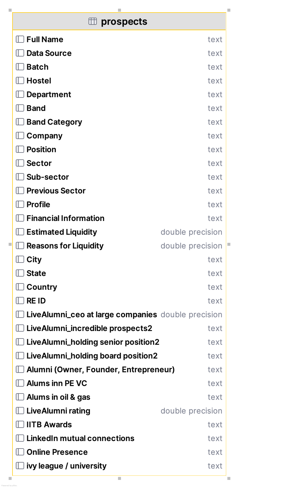

# Donor Research Pipeline

## Overview

This project is designed to assist in donor research by automating and simplifying the process of capturing essential data on employment, education, location, industries, philanthropy, and other key factors needed for prospect net worth calculation. The manual effort traditionally required for such tasks in Excel is significantly reduced through this pipeline.

The application integrates with both a CRM system and the Live Alumni Database, centralizing research data into a single interface. It allows for real-time data capture, updates, and storage in a PostgreSQL database, which can be used to update the CRM system with research outcomes.

## Features
* **Data Integration:** Captures data from CRM using PostgreSQL. 
* **CSV Uploader:** Upload data from Live Alumni via CSV files, and store in PostgreSQL DB. 
* **Unified View:** Displays all prospect research data in a single window, including employment, education, location, industries, and philanthropy. 
* **Research Storage:** Research data is stored and updated in PostgreSQL and can be shared with the Database team for CRM updates.

## Tech Stack
* **Database:** PostgreSQL
* **Frontend:** Streamlit
* **Backend:** Python
* **File Handling:** CSV File Uploader
* **Data Sources:** CRM, Live Alumni Database

## Installation
* Clone the repository:
`git clone https://github.com/khamsakamal48/Donor-Research-Pipeline.git`
* Install dependencies: `pip install -r requirements.txt`
* Set up PostgreSQL DB and configure your connection.
* Run the app: `streamlit run app.py`

## Usage
* Access the app from http://{ip address}:8503/research
* Select the available prospects from the sidebar.

## Pre-requisite
* Table 'donor-research' with prospects schema as below,
